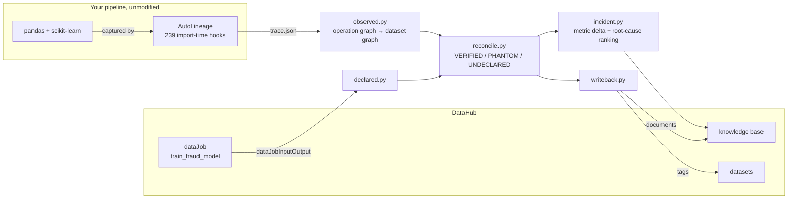

# Polygraph

**A lie detector for data catalogs.**

Your catalog says the fraud model reads `raw_claims` and `legacy_claims_archive`.
Polygraph runs the pipeline, watches what it actually touches, and reports that
`legacy_claims_archive` has not been read since the refactor — while
`fee_schedule`, which nobody declared, is merged into the training set on every
run. Then it writes those findings back into DataHub as tags, so the next person
to open the catalog sees them.

Catalog says X. Runtime proves Y. Polygraph reconciles them inside DataHub's own UI.

Built for [Build with DataHub: The Agent Hackathon](https://datahub.devpost.com/).

---

## The problem

Lineage in a data catalog is **testimony**. Someone wrote it down — by hand, or
via an ingestion connector that parsed SQL, or from a DAG definition. Then the
code changed and the testimony did not.

Nobody notices, because a catalog has no way to be wrong out loud. A stale edge
looks exactly like a correct one. A missing edge looks like nothing at all. Data
scientists make decisions on lineage that has quietly drifted from reality, and
the first sign of trouble is a model that stopped working for reasons no one can
trace.

Polygraph closes that loop by making the runtime testify.

---

## Verdict semantics

| Verdict | Means | Tag written |
| --- | --- | --- |
| `VERIFIED` | Declared, and runtime capture proves data flowed along it | `polygraph:verified` |
| `PHANTOM` | Declared, but nothing flowed along it in the captured run | `polygraph:phantom` |
| `UNDECLARED` | Runtime proves the edge exists; the catalog never mentioned it | `polygraph:undeclared-source` |

Read those carefully, because the asymmetry is real and Polygraph does not paper
over it:

- `VERIFIED` is evidence **from the run that was captured**. It is not a proof
  about every run.
- `PHANTOM` means nothing flowed **in this run**. A genuinely conditional edge —
  a branch not taken — will look phantom. The report always names the run it is
  based on so a human can make that call.
- An observed node with no entry in `urn_map.yaml` is reported as **unmapped**,
  never guessed at. Polygraph does no fuzzy matching.

---

## Quickstart

Prerequisites: Docker Desktop with ~8 GB allocated, Python 3.11+, ~13 GB free
inside the Docker VM.

```bash
git clone https://github.com/kishanraj41/datahub-polygraph
cd datahub-polygraph
python -m venv .venv && . .venv/bin/activate    # Windows: .venv\Scripts\activate
pip install -r requirements.txt

# 1. Stand up DataHub (first run pulls ~8 GB, 10-25 min)
datahub docker quickstart
datahub init --username datahub --password datahub

# 2. Seed the catalog with deliberately imperfect lineage
python demo/seed_catalog.py

# 3. Run the pipeline under AutoLineage capture
python demo/pipeline.py --mode healthy

# 4. Reduce the capture to a dataset-level graph
python -m polygraph.cli observe \
    --trace runs/healthy/trace.json \
    --out   runs/healthy/observed_graph.json --root .

# 5. Reconcile declared against observed
python -m polygraph.cli reconcile --observed runs/healthy/observed_graph.json

# 6. Write the verdicts back into DataHub
python -m polygraph.cli writeback \
    --report   examples/reconciliation_report.json \
    --document examples/reconciliation_report.md
```

Open <http://localhost:9002> (login `datahub` / `datahub`) and look at
`polygraph.demo.fee_schedule`. It is tagged `polygraph:undeclared-source`.

On Windows, `scripts/run_gate1.ps1` then `scripts/run_gate2.ps1` do all of the
above with preflight checks.

### The incident path

```bash
python demo/pipeline.py --mode buggy     # one changed line collapses F1
python -m polygraph.cli observe --trace runs/buggy/trace.json \
    --out runs/buggy/observed_graph.json --root . --mode buggy
python -m polygraph.cli incident
```

---

## Real output

Everything below is copied from actual runs, reproduced on two machines
(Linux/Python 3.11 and Windows 11/Python 3.12) with the pinned dependencies in
`requirements.txt`. Full artifacts are in [`examples/`](examples/).

**Reconciliation** — one of each verdict against the seeded catalog:

| Verdict | Upstream | Operations observed |
| --- | --- | --- |
| `VERIFIED` | `polygraph.demo.raw_claims` | filter → concat → merge → drop → select → LogisticRegression.fit |
| `PHANTOM` | `polygraph.demo.legacy_claims_archive` | — |
| `UNDECLARED` | `polygraph.demo.fee_schedule` | filter → merge → drop → select → LogisticRegression.fit |

**Incident** — one changed line (`quantile(0.999)` → `quantile(0.05)`):

| | baseline | degraded |
| --- | ---: | ---: |
| F1 | 0.8282 | 0.0000 |
| rows after filter | 5994 | 300 |

AutoLineage's analyzer localises the collapse to the **`filter`** operation with
an impact score of 1.0, against a next-ranked deviation three orders of
magnitude lower. The incident document names the owning team
(`urn:li:corpGroup:ml-platform-team`) resolved live from DataHub ownership.

The document's sha-256 is stored on the DataHub document as `polygraph_sha256`.
The report is byte-reproducible: rerunning the incident path on the same code
produces the identical file and therefore the identical digest. You can check
both — hash the shipped file, then regenerate it and hash again:

```bash
sha256sum examples/incident_report.md
# acbedff47da6255e6b69877f722e52c2421f711e560d8517919e04bfe12ee5d3
```

---

## Ask an agent instead

`mcp-server-datahub` lets an agent read what the catalog **claims**. Polygraph
ships its own MCP server so the same agent can read what the runtime **proved**,
and the gap between them.

```bash
python -m polygraph.mcp_server        # stdio
```

Register it alongside DataHub's own server in `claude_desktop_config.json`:

```json
{
  "mcpServers": {
    "polygraph": {
      "command": "python",
      "args": ["-m", "polygraph.mcp_server"],
      "env": { "PYTHONPATH": "/path/to/datahub-polygraph/src" }
    }
  }
}
```

| Tool | Answers |
| --- | --- |
| `can_i_trust(asset_urn)` | Did this asset's declared lineage survive a real run? |
| `get_integrity_score(job_urn)` | Score, precision, recall, and which way the catalog is wrong |
| `list_undeclared_sources()` | What does the pipeline read that nobody declared? |
| `list_phantom_edges()` | Which declared edges carried no data? |
| `get_incident_report(urn)` | The hash-verified incident, root operation and owner |
| `explain_verdict_semantics()` | What the verdicts do **not** establish |

Two design choices worth naming, because they are what stop an agent from
overstating the findings:

**Absent evidence is never silence.** Every tool returns `evidence_available`.
Asked about an asset Polygraph has not examined, `can_i_trust` says so
explicitly — *"there is no evidence either way. Do not treat this as a clean
bill of health."* An empty result that reads as "nothing wrong" is the failure
mode this project exists to complain about, so the server refuses to produce
one.

**Every tool returns evidence, not just a verdict.** An agent that relays the
verdict is correct; one that reads the operation paths can disagree with it.
`explain_verdict_semantics` exists so an agent can look up what a verdict does
*not* establish before repeating it to a person.

### Or ask from the command line

```bash
polygraph ask "what undeclared sources does the pipeline read?"
polygraph ask "can I trust fee_schedule?"
polygraph ask "why did f1 drop?"
```

Two backends over the **same six tool functions** — there is one implementation
of "can I trust this asset", not two:

**Deterministic (default).** A keyword router. It needs no API key and produces
identical output for identical input, which is why every claim in this README
reproduces from a bare clone. It is not an agent and does not describe itself as
one. Asked something it cannot classify, it declines and lists what it can
answer rather than running the nearest-matching tool — silently answering a
different question than the one asked is worse than declining. Exit code 3 when
it does not understand, so it is scriptable.

**LLM (`--llm`).** A real tool-use loop; the model picks tools and writes the
answer from what they return. Needs `ANTHROPIC_API_KEY` and `pip install
anthropic`. Gated behind a flag on purpose: a judge should never need
credentials to verify a documented result. Without a key it says so plainly
rather than degrading into something else.

---

## Architecture



The interesting problem is the middle box. AutoLineage records lineage at
*operation* granularity — every pandas transform, every sklearn call, linking
dataframe versions. DataHub declares lineage at *dataset* granularity. Bridging
them required three non-obvious decisions, documented in
[`src/polygraph/observed.py`](src/polygraph/observed.py):

1. **Anchors.** A node is catalog-visible if it is a file read, a file write, or
   a fitted model. Two anchors form an edge when a path connects them through no
   other anchor.
2. **Union of paths, not shortest path.** AutoLineage links
   `LogisticRegression.fit` directly back to an early hub node, so the shortest
   route from source file to model skips the filter, the merge and the split.
   Those operations really ran between the two assets. Shortest-path would have
   left the incident report with nothing to name.
3. **Self-loops carry the payload.** When a transform does not change dataframe
   identity, AutoLineage emits `parent_id == child_id`. The planted bug *is* one
   of those. Discarding them is correct for topology and catastrophic for
   diagnosis.

---

## Limitations

Stated plainly, because a tool that accuses catalogs of lying should be direct
about what it cannot do.

- **Single-run evidence.** Every verdict describes one captured run. Conditional
  branches not taken during capture are indistinguishable from dead edges.
- **Inputs only.** Polygraph reconciles edges *into* a job. It does not
  reconcile outputs. AutoLineage cannot link a numpy `predict()` output into a
  newly constructed DataFrame, so a declared `job → predictions` edge would come
  back `PHANTOM` — a tool limitation dressed up as a stale catalog edge. Scoping
  to inputs is also what the tags claim: `undeclared-source`.
- **Shape-preserving bugs are invisible.** The analyzer ranks row-count and
  column-count deviations. A unit error that scales a column by 1000 while
  preserving every shape would not appear at all.
- **Localisation is to an operation, not a line number.**
- **Info-level anomalies are excluded from the incident report.** AutoLineage
  emits timing-sensitive counters at `info` severity that vary between identical
  runs. Including them made the report non-reproducible — same code, same seed,
  different sha-256. They are filtered so the published digest means something;
  they do not affect localisation.
- **Synthetic demo data.** `demo/pipeline.py` generates its own 6,000-row
  dataset with a fixed seed so the demo reproduces from a clean clone with no
  downloads. The AutoLineage paper's headline case uses the real Kaggle
  credit-card fraud dataset; that data is 150 MB and not redistributable, so it
  is not part of this repo.
- **`pathlib.Path` breaks capture.** AutoLineage's IO hooks test
  `isinstance(path, str)`, so `pd.read_csv(Path(...))` records *nothing* — no
  file lineage at all, silently. `demo/pipeline.py` passes `str(...)`
  explicitly. This is an upstream bug, not a design choice.
- **Python 3.12 is untested by DataHub.** The CLI warns. It worked throughout
  this build, but 3.11 is the supported version.
- **One pipeline, one catalog shape.** The URN mapping is explicit YAML. Using
  Polygraph on your own pipeline means writing your own `urn_map.yaml`.

---

## Papers

Polygraph builds on two pieces of prior work:

1. **AutoLineage: Zero-Code Data Lineage for Python ML Pipelines** — the capture
   library and the planted-bug evaluation this demo's fraud pipeline is drawn
   from. [SSRN 6683825](https://papers.ssrn.com/sol3/papers.cfm?abstract_id=6683825)
2. **RudriQ** — deviation-weighted root-cause analysis and deterministic audit
   reporting. `[KISHAN: Paper 2 SSRN URL]`

`autolineage` is MIT and on PyPI. Polygraph depends on it as a published
package; no code was copied.

---

## License

Apache License 2.0. See [LICENSE](LICENSE).
